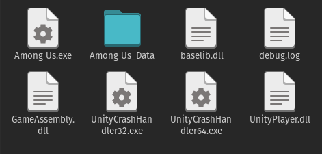
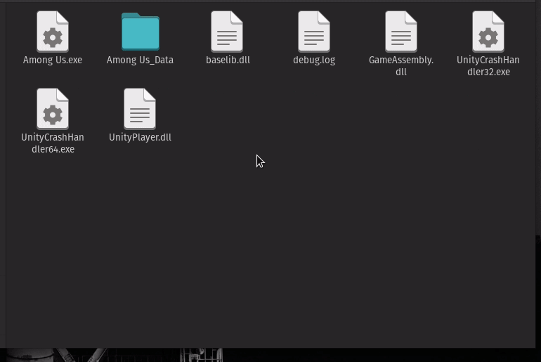

# among-us-linux-runner
Script to set up Among Us on Linux

---

## How to use

### Get Among Us
First of all, you have to get the game itself.
The file may be something like this:



### Get the runner
Download the runner on [releases](https://github.com/luisfelipesdn12/among-us-linux-runner/releases) or just click to [download the whole project](https://github.com/luisfelipesdn12/among-us-linux-runner/archive/refs/heads/main.zip) on GitHub.

### Place the runner files
Once downloaded, extract the `.zip` file and place the `setup.sh`, `among-us.desktop` and `among_us_icon.png` in the root of the game folder.

#### Demonstration


### Run the setup script
With the terminal at the game directory, run this:

```sh
chmod +x setup.sh && sudo ./setup.sh
```

Then, type your password to run the script as root and wait the magic to happen!

---

## Result
The result should be a new desktop shortcut with the game :)

---

In case of bugs, suggestions or anything, open an issue!
Made by [Luis Felipe (@luisfelipesdn12)](https://github.com/luisfelipesdn12/among-us-linux-runner)
